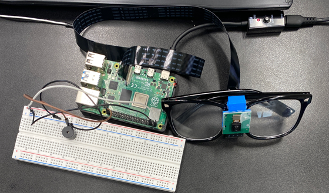

# Smart Glasses
[comment]: <> (description)

| **Engineer** | **School** | **Area of Interest** | **Grade** |
|:--:|:--:|:--:|:--:|
| Shaan S | Bret Harte | Biomedical Engineering | Incoming 8th Grader


  
# Final Milestone

## Modification 1

I modified my smart glasses to detect specific objects in real time using a TensorFlow Lite model. Before starting the system, I can now type in the name of the object I want to detect—like "laptop" or "computer keyboard"—and the glasses will continuously watch for that object. When it’s confidently recognized by the model, a buzzer connected to the Raspberry Pi activates, giving me an audible or tactile alert. I also made sure the buzzer only goes off once per detection to avoid constant buzzing, and it resets when the object is no longer seen. This upgrade makes the glasses much more interactive and customizable, letting me choose what to track on the fly.




### Code

```Python
import os
import subprocess
import RPi.GPIO as GPIO
import time
import ast

# Ask user what to detect before starting
target_label = input("Enter the object label to detect (e.g., laptop): ").strip().lower()

GPIO.setwarnings(False)
GPIO.setmode(GPIO.BCM)
buzzer_pin = 21
GPIO.setup(buzzer_pin, GPIO.OUT)

project_dir = '/home/shaan/rpi-vision'
python_bin = '/home/shaan/Documents/env/bin/python'

env = os.environ.copy()
env['PYTHONPATH'] = project_dir

os.chdir(project_dir)
print("Current directory:", os.getcwd())

proc = subprocess.Popen(
    [python_bin, 'tests/pitft_labeled_output.py', '--tflite'],
    env=env,
    stdout=subprocess.PIPE,
    stderr=subprocess.STDOUT,
    text=True
)

detection_active = False
CONFIDENCE_THRESHOLD = 0.7

try:
    for line in proc.stdout:
        print(line, end='')

        if line.startswith("INFO:root:[('"):
            try:
                detections_str = line.split("INFO:root:")[1].strip()
                detections = ast.literal_eval(detections_str)

                found = False
                for wnid, label, conf in detections:
                    if label.lower() == target_label and conf >= CONFIDENCE_THRESHOLD:
                        found = True
                        break

                if found and not detection_active:
                    print(f"{target_label.capitalize()} confidently detected! Buzzing...")
                    GPIO.output(buzzer_pin, GPIO.HIGH)
                    time.sleep(0.5)
                    GPIO.output(buzzer_pin, GPIO.LOW)
                    detection_active = True
                elif not found and detection_active:
                    print(f"{target_label.capitalize()} no longer detected.")
                    detection_active = False

            except Exception as e:
                print("Error parsing detection line:", e)

except KeyboardInterrupt:
    print("Monitoring stopped by user.")

finally:
    proc.terminate()
    GPIO.cleanup()
```

This Python script monitors a TensorFlow object detection model’s output for a specific object entered by the user (e.g., "computer keyboard"). It converts the input label to lowercase and replaces spaces with underscores to match the model’s label format. The script reads detection results from the model’s live output, checks if the target label is present with at least 70% confidence, and activates a buzzer when the target is confidently detected for the first time. The buzzer stays off until the object disappears and is seen again. It uses the Raspberry Pi’s GPIO pin 21 to control the buzzer and safely resets everything when stopped.

# Second Milestone

<iframe width="560" height="315" src="https://www.youtube.com/embed/KUQzLhIjmnM?si=WQE3oEMpKa3BfVY6" title="YouTube video player" frameborder="0" allow="accelerometer; autoplay; clipboard-write; encrypted-media; gyroscope; picture-in-picture; web-share" referrerpolicy="strict-origin-when-cross-origin" allowfullscreen></iframe>

Since my first milestone, I have made significant and meaningful progress on both the hardware and software components of my project. One of the major improvements was physically attaching the Raspberry Pi Camera to the glasses in a secure and well-aligned position. This step was crucial for making the system wearable and functional in real-world use. On the software side, I successfully set up a live video stream from the camera, which included solving technical issues like fixing color distortion and configuring the camera settings through the PiCamera2 library. I also began working on the object detection aspect by preparing to integrate a TensorFlow Lite model, which will allow the system to identify objects in real time. These improvements have moved me much closer to my ultimate goal of developing an AI-powered wearable vision system, and they provide a strong foundation for the next phase of my work.

This is a diagram of my Second Milestone


## Challenges

One of the main challenges I faced during this phase of the project was figuring out the correct mount for attaching the camera securely to the glasses. It took several attempts to find a position that was both stable and aligned well enough to capture a clear forward-facing view without interfering with the user's vision. Another major challenge was getting the object detection code to work properly. Setting up the TensorFlow Lite model involved dealing with compatibility issues, understanding how to preprocess frames correctly, and making sure the model could run efficiently on the Raspberry Pi without slowing down the video stream. Troubleshooting these problems required a lot of trial and error, but ultimately helped me better understand how real-time computer vision systems function.

## Code
```Python
from flask import Flask, Response, render_template_string
from picamera2 import Picamera2
import cv2

app = Flask(__name__)

# Set up camera
picam2 = Picamera2()
picam2.configure(picam2.create_preview_configuration(
    main={"format": "RGB888", "size": (640, 480)}
))
picam2.start()
picam2.set_controls({"AwbMode": 1})  # Enable auto white balance

# HTML for the camera stream
HTML = """
<!doctype html>
<title>Pi Camera Stream</title>
<h1>Live Stream from Raspberry Pi Camera</h1>

"""

def generate_frames():
    while True:
        frame = picam2.capture_array()
        #frame = cv2.cvtColor(frame, cv2.COLOR_RGB2BGR)  # Convert to correct format
        ret, buffer = cv2.imencode('.jpg', frame)
        if not ret:
            continue
        frame = buffer.tobytes()
        yield (b'--frame\r\n'
               b'Content-Type: image/jpeg\r\n\r\n' + frame + b'\r\n')

@app.route('/')
def index():
    return render_template_string(HTML)

@app.route('/video_feed')
def video_feed():
    return Response(generate_frames(), mimetype='multipart/x-mixed-replace; boundary=frame')

if __name__ == '__main__':
    app.run(host='0.0.0.0', port=5000)
```

This code establishes a live video stream that captures real-time footage using the Raspberry Pi Camera and displays it through a web browser. By setting up a Flask server and using OpenCV to process each video frame, the stream can be accessed over a network, making it easy to monitor the camera feed remotely. This functionality is essential for testing and developing computer vision applications, as it provides a continuous and accessible view of what the camera is seeing. It also serves as the foundation for integrating more advanced features like object detection.

# First Milestone

<iframe width="560" height="315" src="https://www.youtube.com/embed/hwgU-7iSydI?si=aCjqJ5J-OpynQL5M" title="YouTube video player" frameborder="0" allow="accelerometer; autoplay; clipboard-write; encrypted-media; gyroscope; picture-in-picture; web-share" referrerpolicy="strict-origin-when-cross-origin" allowfullscreen></iframe>

My project is called Smart Glasses. The goal is to help people, especially those who can’t see well, by using AI to detect objects around them. I’m building it using a Raspberry Pi 5 and a camera that attaches to it. These parts will go on a glasses frame. The camera takes video of what’s in front of the person, and the AI will figure out what the objects are. Then, the glasses will say what it sees out loud using a speaker so the person knows what’s around them.

So far, I was able to take a picture using the Raspberry Pi and the camera. At first, I tried to set it up without using a monitor or keyboard, but it was really hard and didn’t work for me. Instead, I decided to just plug it into a monitor and use a keyboard and mouse, which made it easier to work on.

My plan now is to find a database of pictures to help train the AI to recognize different objects. Once I get that working, I’ll connect it to a text-to-speech program so the glasses can tell the person what it sees. That way, the Smart Glasses will be able to help people understand what’s around them without needing to see it.

This is my first milestone video:


## Challenges

One of the main challenges I faced during Milestone 1 was setting up the Raspberry Pi for a headless configuration, which means accessing and controlling the Pi remotely without a monitor or keyboard attached. This setup is very convenient because it allows you to program the Raspberry Pi from another computer over a network. However, due to slow and unstable Wi-Fi, I had trouble maintaining a consistent connection, which made the setup process difficult and sometimes impossible to complete. This experience taught me how important a reliable network is for remote device management and pushed me to troubleshoot connectivity issues while learning more about networking and remote access tools like SSH.

## Next Steps

The next steps for this project are to get the camera module working so it can detect and recognize different objects by using a database of known items. This means setting up software that can compare what the camera sees with stored information to identify objects accurately. At the same time, I plan to set up a continuous video stream so that the camera feed can be viewed and analyzed in real time. Having this live video combined with object detection will let the system recognize and classify objects as they come into view, making it more interactive and useful. To do this, I’ll need to explore different machine learning models, figure out how to run them efficiently on the Raspberry Pi, and make sure the camera, detection program, and database all work smoothly together. These steps will really push the project forward and help build a smart vision system that can respond to what it sees.

## Code
```Python
from picamera2 import Picamera2, Preview
import time
import cv2
picam2 = Picamera2()
camera_config = picam2.create_still_configuration(main={"size": (1920, 1080)},
lores={"size": (640, 480)}, display="lores")
picam2.configure(camera_config)
#picam2.start_preview(Preview.QTGL) #Comment this out if not using desktop interface
picam2.start()
time.sleep(2)
im = picam2.capture_array()
im = cv2.cvtColor(im, cv2.COLOR_BGR2RGB)
cv2.imwrite('file.png', im)
```
This code initializes the Raspberry Pi Camera using the Picamera2 library, configures it to capture a still image at a resolution of 1920x1080, and starts the camera. After a brief delay to allow the camera to adjust, it captures an image, converts its color format from BGR to RGB using OpenCV, and saves the image as "file.png".

[comment]: <> (# Schematics)

[comment]: <> (work in progress)

[comment]: <> (# Code)

[comment]: <> (work in progress)

# Bill of Materials

| Part                    | Note                                  | Price | Link                                                                                                     |
|-------------------------|-------------------------------------|-------|----------------------------------------------------------------------------------------------------------|
| Raspberry Pi 5          | Latest Raspberry Pi model             | $75   | [Buy here](https://www.raspberrypi.org/products/raspberry-pi-5/)                                         |
| Pi Camera Module        | Official camera for Raspberry Pi     | $30   | [Buy here](https://www.raspberrypi.org/products/camera-module-v3/)                                       |
| Non-prescription Glasses| Black rectangular fashion glasses    | $12   | [Buy here](https://www.amazon.com/GQUEEN-201512-Fashion-Rectangular-Glasses/dp/B00ZRD1MEI/)               |


[comment]: <> (# Other Resources/Examples)

[comment]: <> (work in progress)

# Starter Project
This is the retro arcade console I built for this project, using the VOGURTIME Electronic Soldering Practice Kit. The kit came with pre-manufactured components, including a mini circuit board, joystick, LED display, and tactile buttons. The goal was to assemble a fully functional mini arcade game system by carefully soldering all the components to the PCB. Once completed, the arcade console lights up, plays sound, and allows simple interactive gameplay, making it a fun and practical introduction to basic electronics.

This is a [link](https://www.amazon.com/Electronic-Soldering-Practice-Comfortable-VOGURTIME/dp/B094QRRHC2/ref=sr_1_3?asc_source=01H2RCFWNNZMQFGXGXS3RMXVE5&crid=12C0SOV36FG6M&dib=eyJ2IjoiMSJ9.Prj06eg0mzBHrfW8zuFr43Ott4t2wUOVBo8A8bYw0PqFZRlOEmgR5YwhMy7jXrdI2HlBjVttnEyYLz5CP684SzJyHmVMBp25vNna9o8wjV-df55ilTgj0xMy1CiRwkcnu6xqacZ3JUPlq8C3mQJwmEtoeokndNqpwpdkZBQMplM9vg3M-cfB0xM_nXdjeqHQ3bB707ehrzX6Llp-Euu3CTFzF8wgEqhPwo6RCvzbo5M.yyrFg8EXJr9BL5cOgZF551-8cIl91p0MSy8nGiilcpU&dib_tag=se&keywords=arcade%2Bsolder%2Bproject&qid=1717994267&sprefix=arcade%2Bsolder%2Bprojec%2Caps%2C147&sr=8-3&tag=snxs3-20&th=1) for the Retro Arcade Console:

This is a video of me demoing the Retro Arcade Console:

<iframe width="560" height="315" src="https://www.youtube.com/embed/FWgXDVm8kqY?si=U474cKpsJ89gVsbU" title="YouTube video player" frameborder="0" allow="accelerometer; autoplay; clipboard-write; encrypted-media; gyroscope; picture-in-picture; web-share" referrerpolicy="strict-origin-when-cross-origin" allowfullscreen></iframe>

## Challenges
One of the biggest challenges I faced was soldering the components precisely. Many of the soldering points were small and tightly packed, which required a steady hand and a lot of focus. It took some trial and error to get the hang of it, but I eventually learned that good soldering comes down to patience, attention to detail, and proper technique. Overall, this was a great project for learning hands-on skills in electronics through a fun and engaging experience.

## Next Steps
My next steps for this project involve beginning the initial phase of my intensive project. This first milestone will focus on assembling and configuring the core hardware components: a Raspberry Pi 5 and the official Pi Camera Module. I will begin by carefully connecting the camera to the Raspberry Pi using the appropriate ribbon cable and ensuring the hardware is properly secured and recognized by the system.

Once the hardware is set up, I will move on to the software configuration. This includes enabling the camera interface through the Raspberry Pi OS settings and installing any necessary libraries or dependencies required to operate the camera. I will be using Visual Studio Code as my development environment to write and test Python scripts that allow the camera to capture still images.

The goal of this milestone is to successfully capture a still photo using the Pi Camera, laying the groundwork for more advanced features later in the project. This step is critical as it ensures that both the hardware and software components are functioning correctly before progressing to more complex parts of my project.

